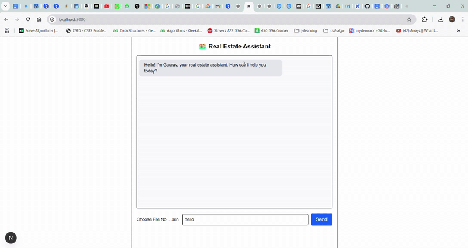
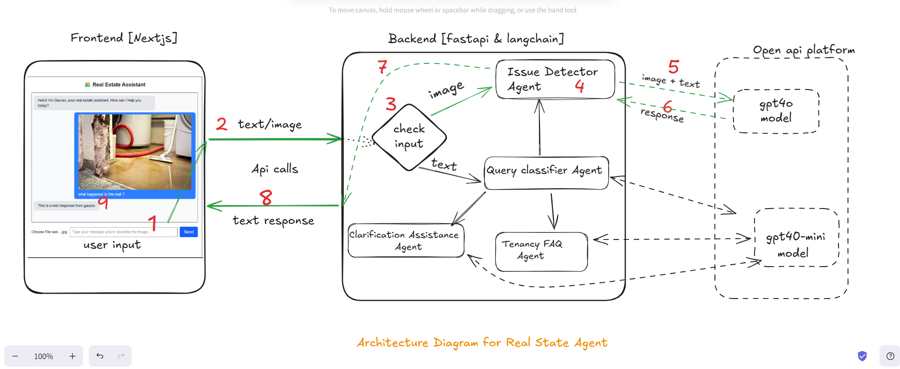

# Real-Estate-Multiagent Chatbot(Image + Text Based)

A Multi-Agent Real Estate Assistant Chatbot, capable of handling both property issue detection and tenancy-related FAQs.

## Demo



## Architecture Diagram


Link- https://excalidraw.com/#json=TUXDTiTGuzBpcRrPMmTpW,tg1bO8JZlpPEv0uwFXZB2A

## Backend Application

The backend application provides APIs to handle user queries, classify messages, and generate responses using OpenAI's GPT models.

### Features

- **Query Classification**: Classifies user Queries into categories like property issues, tenancy FAQs, or unclear queries.
- **Property Issue Detection**: Detects visible property issues from user-uploaded images and text and suggests fixes.
- **Tenancy FAQ Assistance**: Answers tenancy and rental-related questions.
- **Clarification Assistance**: Asks follow-up questions for unclear queries.

### Technologies Used

- **FastAPI**: For building the backend API.
- **LangChain**: For managing conversational AI workflows.
- **OpenAI GPT Models**: For generating responses.
- **Python**: Backend programming language.

## Frontend Application - Agent UI

The frontend application for the Real-Estate-Multiagent project. It provides a user interface for interacting with the real estate assistant bot.

### Features

- **Chat Interface**: Allows users to send messages and upload images.
- **Real-Time Responses**: Displays responses from the backend in a conversational format.
- **File Upload**: Supports uploading images for property issue detection.

### Technologies Used

- **Next.js**: For building the frontend application.
- **React**: For creating interactive UI components.
- **Tailwind CSS**: For styling the application.

## Local-setup

Note - Steps are for WSl and linux it may change for windows

### Clone the repo on your local system

```
git clone git@github.com:Grv-trivedi/Real-Estate-Multiagent.git
```

### Frontend App(Next js)

#### 1. Navigate to frontend app

```
 cd agentui
```

#### 2. Install dependencies

```
 npm i
```

#### 3. Start the development server

```
 npm run dev
```

### Now Open a new terminal

### Backend (Fast Api)

#### 1. Navigate to backend

```
 cd agent_backend
```

#### 2. Set up Python virtual environment

```
 python -m venv venv
 source venv/bin/activate  # Windows: venv\Scripts\activate
```

#### 3. Install dependencies

```
 pip install -r requirements.txt
```

#### 4. Add your OpenAI API key

- Create a .env file in the backend folder.
- Add the following key in the .env

```
 OPENAI_API_KEY=sk-xxxxx-your-key-here
```

#### 5. Run the FastAPI server

```
fastapi dev main.py
```

###
